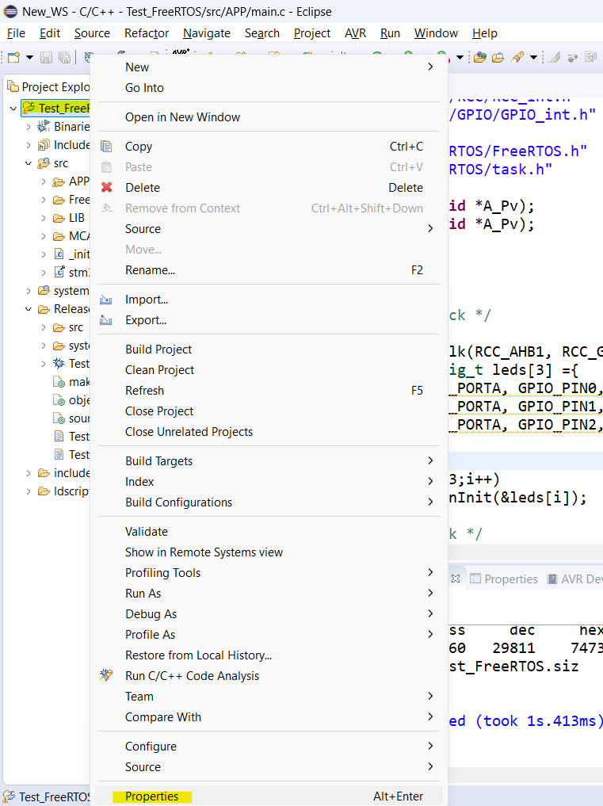

# Session: FreeRTOS
## Environment Setup:

<br>


<br>

## Lab 1: 
We have two tasks. First task blinks a LED every 200 msec and the other one blinks a LED every 1000 msec.

```c
#include "../LIB/STD_TYPES.h"
#include "../LIB/BIT_MATH.h"

#include "../MCAL/RCC/RCC_int.h"
#include "../MCAL/GPIO/GPIO_int.h"

#include "../FreeRTOS/FreeRTOS.h"
#include "../FreeRTOS/task.h"

void Task_LED1(void *A_Pv);
void Task_LED2(void *A_Pv);


int main(void)
{
	/* Enable Clock */
	MRCC_vInit();
	MRCC_vEnableClk(RCC_AHB1, RCC_GPIOA);

	GPIOx_PinConfig_t leds[3] ={
			{GPIO_PORTA, GPIO_PIN0, GPIO_MODE_OUTPUT, GPIO_OT_PUSHPULL, GPIO_SPEED_LOW, GPIO_NO_PULL},
			{GPIO_PORTA, GPIO_PIN1, GPIO_MODE_OUTPUT, GPIO_OT_PUSHPULL, GPIO_SPEED_LOW, GPIO_NO_PULL}
	};

	for(u8 i=0;i<2;i++)
		MGPIO_vPinInit(&leds[i]);

	/* Create Task */
	xTaskCreate(Task_LED1,(const char * const) "LED1", 85,  NULL, 1, NULL);
	xTaskCreate(Task_LED2,(const char * const) "LED2", 85,  NULL, 3, NULL);


	/* Start Scheduler */
	vTaskStartScheduler();

	while(1)
	{

	}

	return 0 ;
}


void Task_LED1(void *A_Pv)
{
	while(1)
	{
		MGPIO_TogPinValue(GPIO_PORTA, GPIO_PIN0);
		vTaskDelay(200);
	}
}
void Task_LED2(void *A_Pv)
{
	while(1)
	{
		MGPIO_TogPinValue(GPIO_PORTA, GPIO_PIN1);
		vTaskDelay(1000);
	}

}

```
## Lab 2: Race Condition
Create Two TASKS useing RGB led:
1. Turn Red LED for 500 ms.
2. Turn Blue LED for 500 ms.

### FreeRTOSConfig.h
```c
#define configCPU_CLOCK_HZ				( 25000000UL )
#define configTICK_RATE_HZ				( ( TickType_t ) 1000 ) // 1 OS tick each 1ms
#define configMAX_PRIORITIES			( 5 ) // max 5 then priorities are (0, 1, 2, 3, 4)
#define configMINIMAL_STACK_SIZE		( ( unsigned short ) 128	 ) /*pwr of 2*/
#define configTOTAL_HEAP_SIZE			( ( size_t ) ( 20 * 1024 ) )

```

### main.c

```c
#include "../LIB/STD_TYPES.h"
#include "../LIB/BIT_MATH.h"

#include "../MCAL/RCC/RCC_int.h"
#include "../MCAL/GPIO/GPIO_int.h"

#include "../FreeRTOS/FreeRTOS.h"
#include "../FreeRTOS/task.h"

void Task_LED_Red(void *A_Pv);
void Task_LED_Blue(void *A_Pv);


int main(void)
{
	/* Enable Clock */
	MRCC_vInit();
	MRCC_vEnableClk(RCC_AHB1, RCC_GPIOA);
	GPIOx_PinConfig_t leds[2] ={
			{GPIO_PORTA, GPIO_PIN0, GPIO_MODE_OUTPUT, GPIO_OT_PUSHPULL, GPIO_SPEED_LOW, GPIO_NO_PULL},
			{GPIO_PORTA, GPIO_PIN1, GPIO_MODE_OUTPUT, GPIO_OT_PUSHPULL, GPIO_SPEED_LOW, GPIO_NO_PULL},

	};
	for(u8 i=0;i<2;i++)
		MGPIO_vPinInit(&leds[i]);

	/* Create Task */
	xTaskCreate(Task_LED_Red,(const char * const) "Red", 128,  NULL, 4, NULL);
	xTaskCreate(Task_LED_Blue,(const char * const) "Blue", 128,  NULL, 4, NULL);


	/* Start Scheduler */
	vTaskStartScheduler();

	while(1)
	{

	}

	return 0 ;
}


void Task_LED_Red(void *A_Pv)
{
	while(1)
	{
		MGPIO_TogPinValue(GPIO_PORTA, GPIO_PIN0);
		vTaskDelay(500);
	}
}
void Task_LED_Blue(void *A_Pv)
{
	while(1)
	{
		MGPIO_TogPinValue(GPIO_PORTA, GPIO_PIN1);
		vTaskDelay(500);
	}

}

```
## Lab 2: using Semaphore 

```c
#include "../LIB/STD_TYPES.h"
#include "../LIB/BIT_MATH.h"

#include "../MCAL/RCC/RCC_int.h"
#include "../MCAL/GPIO/GPIO_int.h"

#include "../FreeRTOS/FreeRTOS.h"
#include "../FreeRTOS/task.h"
#include "../FreeRTOS/semphr.h"

SemaphoreHandle_t Red_Sem;
SemaphoreHandle_t Blue_Sem;

void Task_LED_Red(void *A_Pv);
void Task_LED_Blue(void *A_Pv);


int main(void)
{
	/* Enable Clock */
	MRCC_vInit();
	MRCC_vEnableClk(RCC_AHB1, RCC_GPIOA);
	GPIOx_PinConfig_t leds[2] ={
			{GPIO_PORTA, GPIO_PIN0, GPIO_MODE_OUTPUT, GPIO_OT_PUSHPULL, GPIO_SPEED_LOW, GPIO_NO_PULL},
			{GPIO_PORTA, GPIO_PIN1, GPIO_MODE_OUTPUT, GPIO_OT_PUSHPULL, GPIO_SPEED_LOW, GPIO_NO_PULL},

	};
	for(u8 i=0;i<2;i++)
		MGPIO_vPinInit(&leds[i]);

	/* Create binary semaphores */
	vSemaphoreCreateBinary(Red_Sem);
	vSemaphoreCreateBinary(Blue_Sem);

	if(Red_Sem != NULL && Blue_Sem != NULL)
	{

		/* Start with Red's turn */
		xSemaphoreGive(Red_Sem);

		/* Create Task */
		xTaskCreate(Task_LED_Red,(const char * const) "Red", 128,  NULL, 2, NULL);
		xTaskCreate(Task_LED_Blue,(const char * const) "Blue", 128,  NULL, 2, NULL);


		/* Start Scheduler */
		vTaskStartScheduler();
	}

	while(1)
	{

	}

	return 0 ;
}


void Task_LED_Red(void *A_Pv)
{
	while(1)
	{
		BaseType_t rgb_state = xSemaphoreTake(Red_Sem, portMAX_DELAY);
		if(rgb_state  == pdPASS)
		{
			MGPIO_vSetPinValue(GPIO_PORTA, GPIO_PIN0, GPIO_LOW);
			MGPIO_vSetPinValue(GPIO_PORTA, GPIO_PIN1, GPIO_HIGH);

			vTaskDelay(500);

			/* Give turn to Blue */
			xSemaphoreGive(Blue_Sem);
		}


	}
}

void Task_LED_Blue(void *A_Pv)
{
	while(1)
	{
		BaseType_t rgb_state = xSemaphoreTake(Blue_Sem, portMAX_DELAY);
		if(rgb_state == pdPASS)
		{
			MGPIO_vSetPinValue(GPIO_PORTA, GPIO_PIN0, GPIO_HIGH);
			MGPIO_vSetPinValue(GPIO_PORTA, GPIO_PIN1, GPIO_LOW);

			vTaskDelay(500);

			/* Give turn back to Red */
			xSemaphoreGive(Red_Sem);
		}

	}

}

```

## Lab 3 : Synchronization (task communication using Counting semaphore)

### FreeRTOSConfig.h

```c
#define configUSE_COUNTING_SEMAPHORES	1
```
### main.c
```c
#include "../LIB/STD_TYPES.h"
#include "../LIB/BIT_MATH.h"

#include "../MCAL/RCC/RCC_int.h"
#include "../MCAL/GPIO/GPIO_int.h"
#include "../MCAL/EXTI/EXTI_int.h"
#include "../MCAL/NVIC/NVIC_int.h"

#include "../FreeRTOS/FreeRTOS.h"
#include "../FreeRTOS/task.h"
#include "../FreeRTOS/queue.h"
#include "../FreeRTOS/semphr.h"


SemaphoreHandle_t xSemaphore;
volatile u8 buttonPressedFlag = 0;

/* Function Prototypes */
void APP_EXTI_Handler(void);
void Task_LED(void* pvParameters);
void Task_Button(void* pvParameters);

/* ISR Callback */
void APP_EXTI_Handler(void)
{
	buttonPressedFlag = 1; // Set flag to indicate button press
}


int main(void)
{
	/* Enable Clock */
	MRCC_vInit();
	MRCC_vEnableClk(RCC_AHB1, RCC_GPIOA);
	MRCC_vEnableClk(RCC_APB2, 14);


	EXTI_Cng_t x = {0,0};       // no need right now, just to keep init func as it is
	MEXTI_vInit(&x);
	MEXTI_vEnableINT(EXTI_LINE0, EXTI_FALLING_EDGE);


	GPIOx_PinConfig_t leds[2] ={
			{.Port = GPIO_PORTA,.Pin = GPIO_PIN0, .Mode = GPIO_MODE_INPUT,.PullType= GPIO_PULL_UP},
			{GPIO_PORTA, GPIO_PIN1, GPIO_MODE_OUTPUT, GPIO_OT_PUSHPULL, GPIO_SPEED_LOW, GPIO_NO_PULL},

	};
	for(u8 i=0;i<2;i++)
		MGPIO_vPinInit(&leds[i]);

	/* Counting semaphore and initially take it */
	xSemaphore = xSemaphoreCreateCounting(5,0);

	/* Create tasks */
	xTaskCreate(Task_LED, (const char * const)"LED", 100, NULL, 1, NULL);
	xTaskCreate(Task_Button, (const char * const)"Button", 100, NULL, 2, NULL);

	/* Register ISR callback */
	MEXTI_vSetCallBack(APP_EXTI_Handler,EXTI_LINE0);

	MNVIC_vEnable_Peripheral_INT(6);

	/* Start scheduler */
	vTaskStartScheduler();

	while(1)
	{

	}

	return 0 ;
}


/* Task 1: Monitors button flag and gives semaphore */
void Task_Button(void* A_Pv)
{
	while(1)
	{
		if(buttonPressedFlag)
		{
			buttonPressedFlag = 0; // Clear flag
			xSemaphoreGive(xSemaphore);
		}
		vTaskDelay(10);
	}
}

/* Task 2: Waits for semaphore and turning LED on */
void Task_LED(void* A_Pv)
{

	while(1)
	{

		/* Waits for semaphore */
		if (xSemaphoreTake( xSemaphore, portMAX_DELAY ) == pdTRUE )
		{

			MGPIO_vSetPinValue(GPIO_PORTA, GPIO_PIN1, GPIO_HIGH);
		}
		vTaskDelay(200);
		MGPIO_vSetPinValue(GPIO_PORTA, GPIO_PIN1, GPIO_LOW);

	}
}

```

# Lab 4:

```c
#include "../LIB/STD_TYPES.h"
#include "../LIB/BIT_MATH.h"

#include "../MCAL/RCC/RCC_int.h"
#include "../MCAL/GPIO/GPIO_int.h"
#include "../MCAL/EXTI/EXTI_int.h"
#include "../MCAL/NVIC/NVIC_int.h"

#include "../FreeRTOS/FreeRTOS.h"
#include "../FreeRTOS/task.h"
#include "../FreeRTOS/queue.h"
#include "../FreeRTOS/semphr.h"


/* Define queue handle */
QueueHandle_t KeyQueue;

/* Function Prototypes */
void Task_7Seg(void* pvParameters);
void Task_Button(void* pvParameters);
u8 Sevensegment[] = {
		0b00111111 ,  // 0
		0b00000110 ,  // 1
		0b01011011 ,  // 2
		0b01001111 ,  // 3
		0b01100110 ,  // 4
		0b01101101 ,  // 5
		0b01111101 ,  // 6
		0b00000111 ,  // 7
		0b01111111 ,  // 8
		0b01101111 ,  // 9

};
GPIOx_PinConfig_t SegmentPins[] ={
		{GPIO_PORTA, GPIO_PIN2, GPIO_MODE_OUTPUT, GPIO_OT_PUSHPULL, GPIO_SPEED_LOW, GPIO_NO_PULL},
		{GPIO_PORTA, GPIO_PIN3, GPIO_MODE_OUTPUT, GPIO_OT_PUSHPULL, GPIO_SPEED_LOW, GPIO_NO_PULL},
		{GPIO_PORTA, GPIO_PIN4, GPIO_MODE_OUTPUT, GPIO_OT_PUSHPULL, GPIO_SPEED_LOW, GPIO_NO_PULL},
		{GPIO_PORTA, GPIO_PIN5, GPIO_MODE_OUTPUT, GPIO_OT_PUSHPULL, GPIO_SPEED_LOW, GPIO_NO_PULL},
		{GPIO_PORTA, GPIO_PIN6, GPIO_MODE_OUTPUT, GPIO_OT_PUSHPULL, GPIO_SPEED_LOW, GPIO_NO_PULL},
		{GPIO_PORTA, GPIO_PIN7, GPIO_MODE_OUTPUT, GPIO_OT_PUSHPULL, GPIO_SPEED_LOW, GPIO_NO_PULL},
		{GPIO_PORTA, GPIO_PIN8, GPIO_MODE_OUTPUT, GPIO_OT_PUSHPULL, GPIO_SPEED_LOW, GPIO_NO_PULL},
};
int main(void)
{
	/* Enable Clock */
	MRCC_vInit();
	MRCC_vEnableClk(RCC_AHB1, RCC_GPIOA);

	GPIOx_PinConfig_t leds[2] ={
			{.Port = GPIO_PORTA,.Pin = GPIO_PIN0, .Mode = GPIO_MODE_INPUT,.PullType= GPIO_PULL_UP},
			{GPIO_PORTA, GPIO_PIN1, GPIO_MODE_OUTPUT, GPIO_OT_PUSHPULL, GPIO_SPEED_LOW, GPIO_NO_PULL},

	};
	for(u8 i=0;i<2;i++)
		MGPIO_vPinInit(&leds[i]);


	/* Initialize pins */
	for(u8 i= 0; i<7; i++ )
		MGPIO_vPinInit(& SegmentPins[i]);

	/* Create queue (length = 5, each item = 1 byte) */
	KeyQueue = xQueueCreate(5, sizeof(u8));

	/* Create tasks */
	xTaskCreate(Task_7Seg, (const char * const)"LED", 100, NULL, 1, NULL);
	xTaskCreate(Task_Button, (const char * const)"Button", 100, NULL, 2, NULL);


	/* Start scheduler */
	vTaskStartScheduler();

	while(1)
	{

	}

	return 0 ;
}


/* Task to check keypad every 50ms and send key to queue */
void Task_Button(void* A_Pv)
{
	u8 key = 0;
	while(1)
	{
		/* get pressed key */
		if (key != 0xFF) // Assume 0xFF = No key pressed
		{
			xQueueSend(KeyQueue, &key, 0); // Send without waiting
		}
		vTaskDelay(50); // 50ms polling rate
	}
}

/* Task to receive key from queue and display it */
void Task_7Seg(void* A_Pv)
{
	u8 bitValue = 0 ;
	u8 key;
	while(1)
	{

		if (xQueueReceive(KeyQueue, &key, portMAX_DELAY) == pdTRUE)
		{
			for(u8 pinNum=0; pinNum<7; pinNum++)
			{
				bitValue = GET_BIT(Sevensegment[key], pinNum);
				MGPIO_vSetPinValue(SegmentPins[0].Port, SegmentPins[pinNum].Pin, bitValue);
			}
		}

	}
}

```