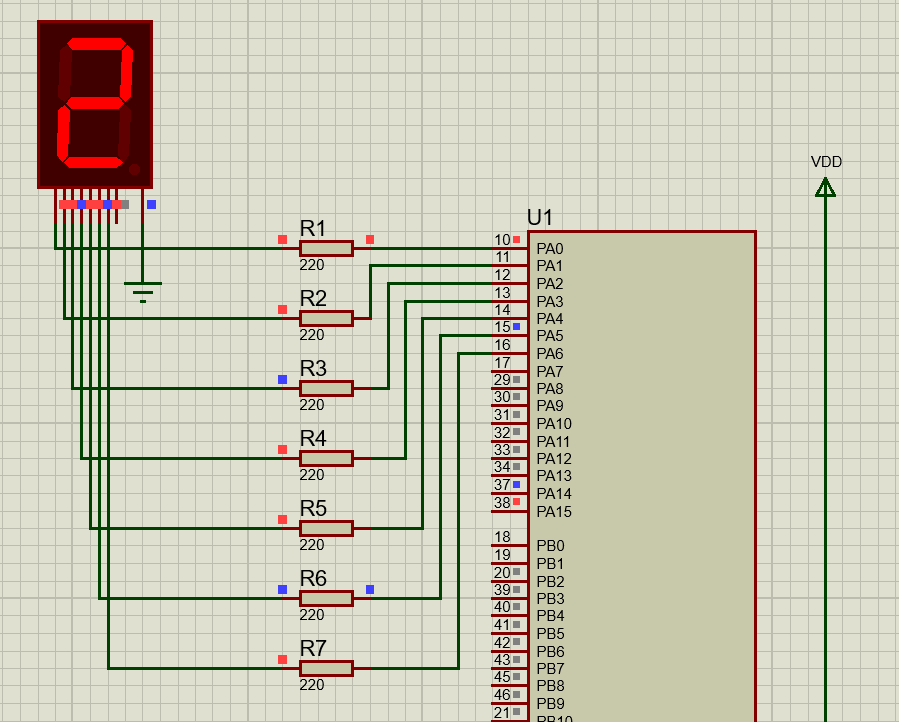

# Session: GPIO
## Lab 1: Use PIN_0 in PORT_A to turn on LED.
```c

#include "../LIB/STD_TYPES.h"
#include "../LIB/BIT_MATH.h"
#include "../MCAL/RCC/RCC_int.h"
#include "../MCAL/GPIO/GPIO_int.h"


int main(void)
{
	MRCC_vInit();
	MRCC_vEnableClk(RCC_AHB1, RCC_GPIOA);

	GPIOx_PinConfig_t LED =
	{GPIO_PORTA,
	GPIO_PIN0,
	.Mode = GPIO_MODE_OUTPUT ,
	.OutputType = GPIO_OT_PUSHPULL,
	.Speed = GPIO_SPEED_LOW,
	.PullType = GPIO_NO_PULL
	};
	MGPIO_vPinInit(& LED);

	MGPIO_vSetPinValue(GPIO_PORTA, GPIO_PIN0, GPIO_HIGH);


	while(1)
	{

	}

	return 0 ;
}

```


## Lab 2: Use PIN_0 in PORT_A to Blink LED.
```c
#include "../LIB/STD_TYPES.h"
#include "../LIB/BIT_MATH.h"
#include "../MCAL/RCC/RCC_int.h"
#include "../MCAL/GPIO/GPIO_int.h"

#define DELAY_MS(d)		do{unsigned int i = d*4000;while(i--){asm("NOP");} }while(0)

int main(void)
{
	MRCC_vInit();
	MRCC_vEnableClk(RCC_AHB1, RCC_GPIOA);

	GPIOx_PinConfig_t LED =
	{GPIO_PORTA,
			GPIO_PIN0,
			.Mode = GPIO_MODE_OUTPUT ,
			.OutputType = GPIO_OT_PUSHPULL,
			.Speed = GPIO_SPEED_LOW,
			.PullType = GPIO_NO_PULL
	};
	MGPIO_vPinInit(& LED);

	while(1)
	{
		MGPIO_vSetPinValue(GPIO_PORTA, GPIO_PIN0, GPIO_HIGH);
		DELAY_MS(500);
		MGPIO_vSetPinValue(GPIO_PORTA, GPIO_PIN0, GPIO_LOW);
		DELAY_MS(500);

	}

	return 0 ;
}

```
## Lab 3: Use PIN_0 in PORT_A to turn on LED when you press on switch connected to your micro.


<br>

```c
#include "../LIB/STD_TYPES.h"
#include "../LIB/BIT_MATH.h"
#include "../MCAL/RCC/RCC_int.h"
#include "../MCAL/GPIO/GPIO_int.h"

#define DELAY_MS(d)		do{unsigned int i = d*4000;while(i--){asm("NOP");} }while(0)

int main(void)
{
	MRCC_vInit();
	MRCC_vEnableClk(RCC_AHB1, RCC_GPIOA);

	GPIOx_PinConfig_t LED =
	{GPIO_PORTA,
			GPIO_PIN0,
			.Mode = GPIO_MODE_OUTPUT ,
			.OutputType = GPIO_OT_PUSHPULL,
			.Speed = GPIO_SPEED_LOW,
			.PullType = GPIO_NO_PULL
	};

	GPIOx_PinConfig_t Button =
	{GPIO_PORTA,
			GPIO_PIN1,
			.Mode = GPIO_MODE_INPUT ,
			.PullType = GPIO_PULL_UP,
	};

	MGPIO_vPinInit(& LED);
	MGPIO_vPinInit(& Button);

	while(1)
	{
		if(MGPIO_u8GetPinValue(GPIO_PORTA,GPIO_PIN1) == 0)
		{
			DELAY_MS(10);
			if(MGPIO_u8GetPinValue(GPIO_PORTA,GPIO_PIN1) == 0)
			{
				MGPIO_vSetPinValue(GPIO_PORTA, GPIO_PIN0, GPIO_HIGH);
				DELAY_MS(50);

			}
		}else{

			MGPIO_vSetPinValue(GPIO_PORTA, GPIO_PIN0, GPIO_LOW);
		}

	}

	return 0 ;
}

```

## Lab 4: 7-Segments


<br>

```c
#include "../LIB/STD_TYPES.h"
#include "../LIB/BIT_MATH.h"
#include "../MCAL/RCC/RCC_int.h"
#include "../MCAL/GPIO/GPIO_int.h"

#define DELAY_MS(d)		do{unsigned int i = d*4000;while(i--){asm("NOP");} }while(0)
u8 Sevensegment[] = {
		0b00111111 ,  // 0
		0b00000110 ,  // 1
		0b01011011 ,  // 2
		0b01001111 ,  // 3
		0b01100110 ,  // 4
		0b01101101 ,  // 5
		0b01111101 ,  // 6
		0b00000111 ,  // 7
		0b01111111 ,  // 8
		0b01101111 ,  // 9

};

int main(void)
{
	MRCC_vInit();
	MRCC_vEnableClk(RCC_AHB1, RCC_GPIOA);

	GPIOx_PinConfig_t SegmentPins[] ={
			{GPIO_PORTA, GPIO_PIN0, GPIO_MODE_OUTPUT, GPIO_OT_PUSHPULL, GPIO_SPEED_LOW, GPIO_NO_PULL},
			{GPIO_PORTA, GPIO_PIN1, GPIO_MODE_OUTPUT, GPIO_OT_PUSHPULL, GPIO_SPEED_LOW, GPIO_NO_PULL},
			{GPIO_PORTA, GPIO_PIN2, GPIO_MODE_OUTPUT, GPIO_OT_PUSHPULL, GPIO_SPEED_LOW, GPIO_NO_PULL},
			{GPIO_PORTA, GPIO_PIN3, GPIO_MODE_OUTPUT, GPIO_OT_PUSHPULL, GPIO_SPEED_LOW, GPIO_NO_PULL},
			{GPIO_PORTA, GPIO_PIN4, GPIO_MODE_OUTPUT, GPIO_OT_PUSHPULL, GPIO_SPEED_LOW, GPIO_NO_PULL},
			{GPIO_PORTA, GPIO_PIN5, GPIO_MODE_OUTPUT, GPIO_OT_PUSHPULL, GPIO_SPEED_LOW, GPIO_NO_PULL},
			{GPIO_PORTA, GPIO_PIN6, GPIO_MODE_OUTPUT, GPIO_OT_PUSHPULL, GPIO_SPEED_LOW, GPIO_NO_PULL},
	};

	u8 bitValue = 0 ;
	u8 pins = 7;
	u8 nums = 10;

	/* Initialize pins */
	for(u8 i= 0; i<pins; i++ )
		MGPIO_vPinInit(& SegmentPins[i]);


	while(1)
	{

		for(u8 num=0; num<nums; num++){
			// display a num
			for(u8 pinNum=0; pinNum<pins; pinNum++)
			{
				bitValue = GET_BIT(Sevensegment[num], pinNum);
				MGPIO_vSetPinValue(GPIO_PORTA, pinNum, bitValue);
			}
			// delay
			DELAY_MS(500);
		}
	}

	return 0 ;
}

```