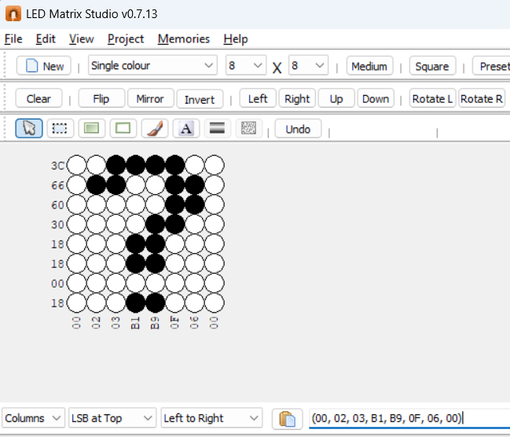

# Session: LED Matrix
## Lab 1:


<br>

```c
#include "../LIB/STD_TYPES.h"
#include "../LIB/BIT_MATH.h"
#include "../MCAL/RCC/RCC_int.h"
#include "../MCAL/GPIO/GPIO_int.h"
#include "../MCAL/NVIC/NVIC_int.h"
#include "../MCAL/EXTI/EXTI_int.h"
#include "../MCAL/SYSTICK/SYSTICK_int.h"
#include "../HAL/LEDMATRIX/LEDMATRIX_int.h"

u8 arr[8] = {0x00, 0x02, 0x03, 0xB1, 0xB9, 0x0F, 0x06, 0x00};
int main(void)
{
	/* Enable Clock */
	MRCC_vInit();
	MRCC_vEnableClk(RCC_AHB1, RCC_GPIOA);
	MRCC_vEnableClk(RCC_AHB1, RCC_GPIOB);

	HLEDMATRIX_vInit();
	HLEDMATRIX_DisplayFrame(arr,500);


	while(1)
	{

	}

	return 0 ;
}


```

## Lab 1: After Changing `HLEDMATRIX_vInit`

```c

#include "../LIB/STD_TYPES.h"
#include "../LIB/BIT_MATH.h"
#include "../MCAL/RCC/RCC_int.h"
#include "../MCAL/GPIO/GPIO_int.h"
#include "../MCAL/NVIC/NVIC_int.h"
#include "../MCAL/EXTI/EXTI_int.h"
#include "../MCAL/SYSTICK/SYSTICK_int.h"
#include "../HAL/LEDMATRIX/LEDMATRIX_int.h"

u8 arr[8] = {0x00, 0x02, 0x03, 0xB1, 0xB9, 0x0F, 0x06, 0x00};

int main(void)
{
	/* Enable Clock */
	MRCC_vInit();
	MRCC_vEnableClk(RCC_AHB1, RCC_GPIOA);
	MRCC_vEnableClk(RCC_AHB1, RCC_GPIOB);

	GPIOx_PinConfig_t rows[8] = {
			{.Port = GPIO_PORTA,.Pin = GPIO_PIN0, .Mode = GPIO_MODE_OUTPUT, .OutputType = GPIO_OT_PUSHPULL, .Speed = GPIO_SPEED_LOW},
			{.Port = GPIO_PORTA,.Pin = GPIO_PIN1, .Mode = GPIO_MODE_OUTPUT, .OutputType = GPIO_OT_PUSHPULL, .Speed = GPIO_SPEED_LOW},
			{.Port = GPIO_PORTA,.Pin = GPIO_PIN2, .Mode = GPIO_MODE_OUTPUT, .OutputType = GPIO_OT_PUSHPULL, .Speed = GPIO_SPEED_LOW},
			{.Port = GPIO_PORTA,.Pin = GPIO_PIN3, .Mode = GPIO_MODE_OUTPUT, .OutputType = GPIO_OT_PUSHPULL, .Speed = GPIO_SPEED_LOW},
			{.Port = GPIO_PORTA,.Pin = GPIO_PIN4, .Mode = GPIO_MODE_OUTPUT, .OutputType = GPIO_OT_PUSHPULL, .Speed = GPIO_SPEED_LOW},
			{.Port = GPIO_PORTA,.Pin = GPIO_PIN5, .Mode = GPIO_MODE_OUTPUT, .OutputType = GPIO_OT_PUSHPULL, .Speed = GPIO_SPEED_LOW},
			{.Port = GPIO_PORTA,.Pin = GPIO_PIN6, .Mode = GPIO_MODE_OUTPUT, .OutputType = GPIO_OT_PUSHPULL, .Speed = GPIO_SPEED_LOW},
			{.Port = GPIO_PORTA,.Pin = GPIO_PIN7, .Mode = GPIO_MODE_OUTPUT, .OutputType = GPIO_OT_PUSHPULL, .Speed = GPIO_SPEED_LOW},
	};

	GPIOx_PinConfig_t cols[8] = {
			{.Port = GPIO_PORTB,.Pin = GPIO_PIN0, .Mode = GPIO_MODE_OUTPUT, .OutputType = GPIO_OT_PUSHPULL, .Speed = GPIO_SPEED_LOW},
			{.Port = GPIO_PORTB,.Pin = GPIO_PIN1, .Mode = GPIO_MODE_OUTPUT, .OutputType = GPIO_OT_PUSHPULL, .Speed = GPIO_SPEED_LOW},
			{.Port = GPIO_PORTB,.Pin = GPIO_PIN2, .Mode = GPIO_MODE_OUTPUT, .OutputType = GPIO_OT_PUSHPULL, .Speed = GPIO_SPEED_LOW},
			{.Port = GPIO_PORTB,.Pin = GPIO_PIN5, .Mode = GPIO_MODE_OUTPUT, .OutputType = GPIO_OT_PUSHPULL, .Speed = GPIO_SPEED_LOW},
			{.Port = GPIO_PORTB,.Pin = GPIO_PIN6, .Mode = GPIO_MODE_OUTPUT, .OutputType = GPIO_OT_PUSHPULL, .Speed = GPIO_SPEED_LOW},
			{.Port = GPIO_PORTB,.Pin = GPIO_PIN7, .Mode = GPIO_MODE_OUTPUT, .OutputType = GPIO_OT_PUSHPULL, .Speed = GPIO_SPEED_LOW},
			{.Port = GPIO_PORTB,.Pin = GPIO_PIN8, .Mode = GPIO_MODE_OUTPUT, .OutputType = GPIO_OT_PUSHPULL, .Speed = GPIO_SPEED_LOW},
			{.Port = GPIO_PORTB,.Pin = GPIO_PIN9, .Mode = GPIO_MODE_OUTPUT, .OutputType = GPIO_OT_PUSHPULL, .Speed = GPIO_SPEED_LOW},
	};

	HLEDMATRIX_vInit(rows, 8, cols, 8);
	// This is about 10s (20ms*500)
	HLEDMATRIX_DisplayFrame(arr, 500);


	while(1)
	{

	}

	return 0 ;
}


```